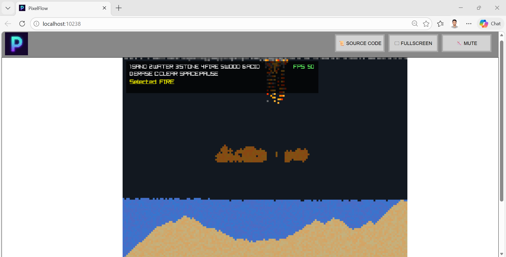

# PixelFlow

## Principle of Programming — Raylib Particle Simulation


---

# Project Overview

PixelFlow is an interactive sandbox-style particle simulation developed in **C** using the **Raylib graphics library**.

In this simulation, every particle is represented as a **single pixel on a two-dimensional grid**. Each pixel behaves as an independent unit with its own state and behaviour. Through simple rule-based logic, particles interact to create realistic material behaviours.

Different particle types follow physical rules such as:

* gravity
* fluid movement
* combustion
* chemical reactions

These rule-based interactions allow complex dynamic patterns to emerge naturally from simple code logic.

This project was developed as part of the **Principle of Programming** module to demonstrate:

* structured programming
* modular design
* abstraction
* state management
* real-time simulation techniques

---

# AI and External Code Acknowledgement

All use of AI tools and external assistance is documented in:

[AI_USAGE.md](AI_USAGE.md)

This documentation follows the module’s academic requirements for transparency in AI usage.

---

# Build Instructions

The project is compiled to **WebAssembly** using the POP build environment.

To compile the program:

```bash
/opt/pop/bin/build-wasm.sh src/main.c src/grid.c src/particle.c src/physics.c src/render.c src/ui.c
```

This command generates an **`out/` directory** containing:

* the compiled `.wasm` file
* supporting JavaScript files
* a generated HTML page used to run the simulation in a browser

---

# Initial Setup (First-Time Execution)

Before running a POP WebAssembly application, a **port must be allocated**.

Run:

```bash
/opt/pop/bin/allocate_port.sh
```

After allocation, open a **new terminal session** so the environment variable updates correctly.

You can verify the port using:

```bash
echo $MY_PORT
```

This should return a **five-digit port number**.

---

# Running the Application

Start the application with:

```bash
/opt/pop/bin/run-wasm.sh
```

This launches a **local web server** that serves the compiled files inside the `out/` directory.

The simulation can then be accessed in the browser using:

```
localhost:XXXXX
```

Where **XXXXX** is the allocated port number.

---

# Simulation Controls

| Key                | Function                  |
| ------------------ | ------------------------- |
| 1                  | Sand                      |
| 2                  | Water                     |
| 3                  | Stone                     |
| 4                  | Fire                      |
| 5                  | Wood                      |
| 6                  | Acid                      |
| 0                  | Eraser                    |
| Space              | Pause / Resume simulation |
| C                  | Clear grid                |
| Left Mouse Button  | Paint particles           |
| Right Mouse Button | Erase particles           |

---

# Simulation Behaviour

Each particle type follows rule-based logic executed during each simulation update.
These behaviours are implemented inside **`physics.c`**.

### Sand

* Affected by gravity
* Moves downward if the cell below is empty
* Slides diagonally if blocked

### Water

* Falls downward due to gravity
* Spreads sideways when blocked
* Simulates fluid flow behaviour

### Stone

* Static particle
* Does not move
* Acts as a solid barrier

### Fire

* Moves upward slowly
* Spreads to flammable materials such as wood
* Disappears after a short lifetime

### Wood

* Static particle
* Burns when in contact with fire
* Converts into fire particles

### Acid

* Flows like a liquid
* Dissolves nearby particles except stone
* Gradually disappears after reacting

---

# Technical Structure

The project follows a **modular architecture**, where responsibilities are separated into individual source files.

## Source Files (.c)

| File         | Responsibility                                 |
| ------------ | ---------------------------------------------- |
| `main.c`     | Program entry point and main simulation loop   |
| `grid.c`     | Grid structure and particle storage            |
| `particle.c` | Particle definitions and creation logic        |
| `physics.c`  | Simulation behaviour and particle interactions |
| `render.c`   | Rendering particles using Raylib               |
| `ui.c`       | Keyboard and mouse input handling              |

---

## Header Files (.h)

Header files define shared:

* data structures
* constants
* function declarations

Examples include:

* `grid.h`
* `particle.h`
* `physics.h`
* `render.h`
* `ui.h`

This modular design improves:

* readability
* maintainability
* debugging

which aligns with the learning objectives of the module.

---

# Project File Structure

The project contains several file types that work together to run the simulation inside a web browser.

### HTML File

Two HTML files are involved in running the WebAssembly application.

**`shell.html`**

This file acts as the template for the browser interface of the WebAssembly application.

It contains:

* a `<canvas>` element for rendering graphics
* interface controls (buttons)
* a console/output area
* the `{{{ SCRIPT }}}` placeholder where the loader script is injected during compilation

This file defines the layout and structure of the webpage used to run the simulation.

---

**`index.html`**

This file is automatically generated during the build process.

It is created from `shell.html` and includes the required scripts to run the WebAssembly program in the browser.

The file loads:

* `index.js` (JavaScript loader)
* `index.wasm` (compiled WebAssembly program)
* `index.data` (runtime assets if present)

This is the actual webpage opened by the browser when the simulation runs.

---

### WebAssembly Binary

Example:

`index.wasm`

This file is the **compiled binary version of the C program**.

It:

* runs inside the browser
* executes at near-native speed
* is generated automatically during compilation

---

### JavaScript Loader

Example:

`index.js`

This generated file loads the `.wasm` module and connects it with browser APIs.

Responsibilities include:

* loading the WebAssembly file
* setting up the runtime environment
* linking browser functionality with C functions

It acts as a **bridge between the browser and the WebAssembly program**.

---

### Data File

Example:

`index.data`

This file contains runtime assets or additional program data.
It is automatically loaded when the WebAssembly application starts.

---

### Markdown Files

Example:

`README.md`

Markdown files are used for project documentation, including:

* build instructions
* project description
* simulation controls
* technical explanations

They render cleanly on platforms such as GitHub.

---

### Shell Scripts

Example:

`build-wasm.sh`

This Bash script automates the compilation process.
It runs the compiler and converts the C source code into:

* `.wasm`
* `.js`
* `.html`

Using a script avoids manually typing long compile commands.

---

### Build Output Folder

**`out/`**

The `out/` directory contains the files generated during compilation.

Typical contents include:

* `index.wasm`
* `index.js`
* `index.html`
* `index.data`

These are **generated build artifacts and should not be edited manually**.

---

# Compilation and Execution Pipeline

The full pipeline for running the simulation in the browser is:

C Source Files (.c + .h)
        ↓
Emscripten Compiler
        ↓
WebAssembly Binary (.wasm)
        ↓
JavaScript Loader (.js)
        ↓
HTML Template (shell.html)
        ↓
Generated Web Page (index.html)
        ↓
Browser Canvas renders the particle simulation
```

This process allows a **C program to run directly inside a web browser using WebAssembly**.

---

# Frame Rate Control

The simulation runs at a **fixed frame rate** using Raylib’s `SetTargetFPS()` function.

Maintaining a stable frame rate ensures that:

* particle movement remains consistent
* simulation speed does not vary between systems
* rendering and physics updates stay synchronized

The current frame rate is displayed using **Raylib’s `GetFPS()` function** for performance monitoring.

---

# Simulation Preview

Below is an example screenshot of the particle simulation running in the browser.



---

# Possible Future Improvements

Several advanced features could be implemented to further extend the simulation:

* Temperature and heat transfer system allowing particles to influence neighbouring materials
* Additional particle types such as oil, lava, or explosive materials
* Particle Sound Effects - Add sound effects for interactions between particles.
* Larger simulation grids with optimisation techniques for improved performance
* Saving and loading sandbox states
* Improved user interface with adjustable brush sizes and particle menus

These improvements would increase both the realism and complexity of the particle system while exploring more advanced programming concepts.
